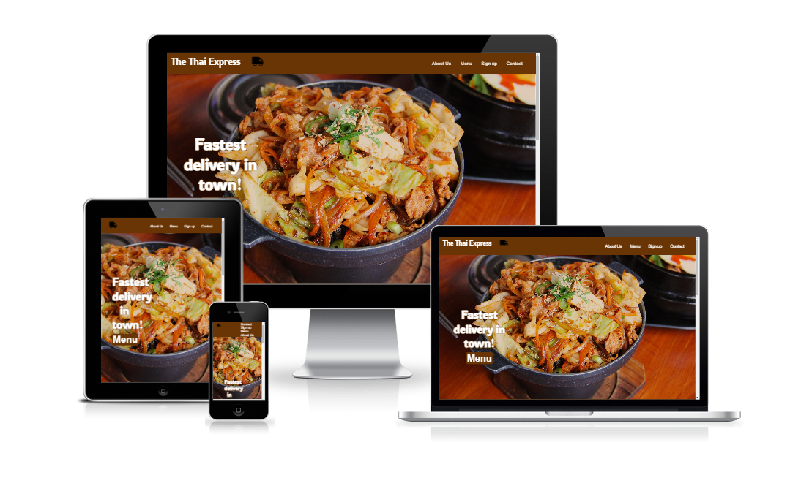

# **The Thai Express** #
The Thai Express is a Thai food delivery service that aims to deliver food to anyone living in Sundbyberg, Sweden in minimum time and at a cheap price.  
This site helps anyone that is hungry and don't want to wait a long time for the food to arrive.  
With a few easy clicks you can have delicious thai food delivered to your door or you can choose to pickup the food at our restaurant.

## **Features** ##
* ### Navigation Bar ###
  * The navigation bar is located at the top of the page and shows the name of the site to the left and links to the different sections to the right.
  * The navigation bar bar is responsive and on smaller screens hides The Thai Express logo and only shows the little delivery truck logo.
  * The font color and background color match up well and the navigation links makes the site easy to explore.

* ### Landing Page ###
  * The background image instantly makes you hungry for some thai food and you are reassured that the delivery time will be fast.
  * The landing page also has a menu button to redirect the user to the menu.  

  

* ### About Us Section ###
  * The About Us section shows what the goal of the site and has a list of information and easy directions to follow.
  * The section also has a table with restaurant open times.  

  

* ### Menu Section ###
  * The menu section shows the menu as two different lists and also shows the price for each dish.
  * The menu section has a black background color to cut it off from the rest of the website for contrast.  

  

* ### The Sign Up form ###
  * This section includes a form where the user sign up for an account.
  * The account will be used when downloading and loggin in to the app.
  * The form includes a first name, last name, email adress and a password.
  * When filled in, the form takes the user to the form.html file where a thank you message will be shown.
  * All rows need to be filled out to be able to sign up.

  

* ### Contact Section ###
  * The contact information is in the footer of the page.
  * To the left we have the contact information wich includes an email, phone number and an adress.
  * In the middle there is a link to download our app from the app store.
  * On the right side sits the social media links to Facebook, Twitter and Instagram.

## Features To Implement ##
* Being able to order directly from the website without having to download the app or having to use a phone call.

## Testing ##

 * The page is tested and works on Chrome, firefox, microsoft edge and safari.
 * The page is responsive and tested using the Chrome Developer Toolbar.
 * All the sections are easy to read and understand and all the links are working and opens in new tabs.
 * The form works as intended and requires every field to be filled out.

 ## Validator Testing ##
* ### HTML ### 
  * The WC3 validator showed no errors in the code.

* ### CSS ### 
  * The WC3 validator seems to be broken as im typing this and it crashes when i try to check the code.
   The last time i checked there were no errors.
   
* ### Accessibility ###
  * Confirmed with lighthouse.

  

## Unfixed Bugs ##
The fixed navigation bar covers the top of the different sections when you click on a navigation link.
i Think i could have fixed it by adding empty divs over the different sections but i failed so far.    
it is something i should have thought about earlier in the project.

## Deplyoment ##
* The site was deployed to GitHub pages. The steps to deploy are as follows.  
  * In the GitHub repository, navigate to the settings tab.
  * Then click on the pages tab.
  * From the source drop-down menu, select diploy from a branch.
  * From the Branch drop-down menu, select main.
The live link can be found here - https://hannes-h98.github.io/project_1/

## Credits ##
### Content ###
* All icons were taken from [Font Awesome](https://fontawesome.com/)
* Instructions on how to code the text shadow on my #hero class in css was taken from a guide on [StackOverflow](https://stackoverflow.com/)
### Media ###
* Landing image were taken from [Pexels](https://www.pexels.com/)

